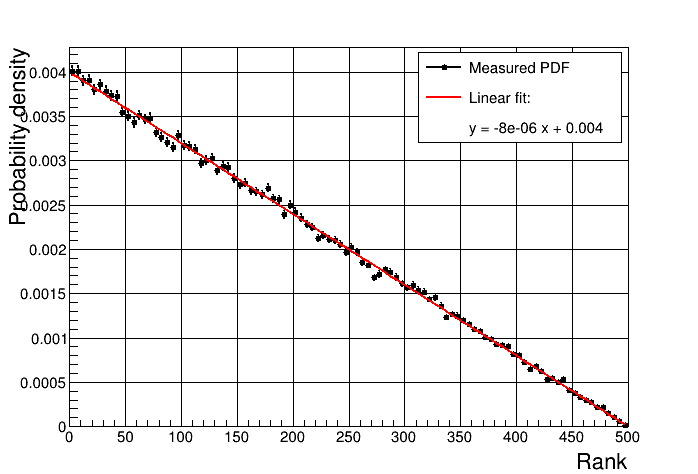
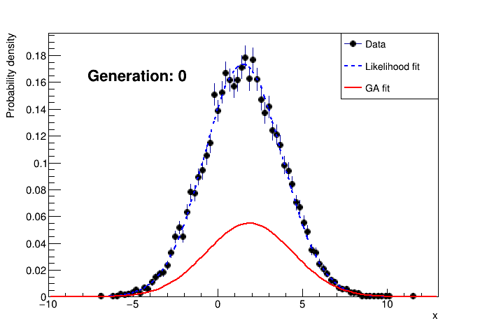

Genetic Algorithm {#mainpage}
=================

Introduction:
-------------

This project is a first of my new one-day-build mini-projects serie.
It is my take on implementing a simple version of the Genetic Algorithm using C++,
with a demo use case consisting of fitting a gaussian distribution to a data histogram. 

\n \n

General Code Description:
-------------------------

This code has been developed and tested on a machine running ubuntu 17.04,
but should work on any linux distribution with gcc instaled.

### Getting the code:

This code is available on GitHub at: \n
<a href="https://github.com/remizaidan/GeneticAlgorithm">
https://github.com/remizaidan/GeneticAlgorithm
</a>

To download from the command-line: \n
> git clone https://github.com/remizaidan/GeneticAlgorithm


### Dependencies:
- ROOT Data Analysis Framework (tested with version 6.10). Documentation and download are avaiable here: \n
<a href="https://root.cern.ch">https://root.cern.ch</a>


### Code structure:

The code is structured into the following sub-directories:
- <b>include</b> Contains all header files.
- <b>src</b> Contains all source files that are to be compiled into static libraries.
- <b>utils</b> Contains all source files that are to be compiled into executables.
- <b>doc</b> Contains documentation files.

After comiling, the following directories may be created:
- <b>bin</b> Contains all executables.
- <b>lib</b> Contains project libraries (shared or static).
- <b>.objs</b> Contains static libraries corresponding to source files in the src folder.
- <b>.deps</b> Contains dependency files.


### Compiling and Running the demo

Compile the demo (replace <N> with the number of cores on your machine):
> make -j<N>

Run the demo:
> ./bin/runGA.exe [options]

For the list of available options see @ref runGA#parseCommandLine or run:
> ./bin/runGA.exe -h


### Other compiling options:

Compile into a shared library:
> make -j<N> shared

Compile into a static library:
> make -j<N> static

Generate the doxygen documentation:
> make doc

\n \n

Algorithms Description:
-----------------------

The genetic algorithm consist of finding the best set of paramters for a given model using the following concepts
(shamelessly stolen from the work of our mother nature over the last several billions of years):
- <b>Population:</b> the genetic algorithm takes as input a population where each individual is a different instance
of a configurable model and evolve it into a population of individuals that best represent the solution to a given problem.
- <b>Variability:</b> variation is at the center of the genetic algorithms: if we have only a handfull of ways to configure
our model, the room for optimization towards a best solution would be limited. The configurations of the initial population
are randomly chosen to allow the exploration of the full phase space of configurations. 
- <b>Selection and cross-over:</b> Some of the individuals in the original population will be better fitted than others to answer the
solution to our problem. A figure of merit is defined to provide a ranking of our population from the best to the least fitted.
The next generation is then constructed by crossing over individuals selected among the best fitted from the
current generation.
- <b>Mutations:</b> To maintain variability through the next generations, occasional mutations are introduced. These
consist of randomoly introducing new features (i.e. new configurations not inherited from the parents), with a controlled
rate.

The genetic algorithm repeats the selection, cross-over and mutations steps until the best fitted individual reach a certain
fitness threshold.

\n \n

Implementation details:
-----------------------

### The demo case:

The demo case generates pseudo-random data following a gaussian distribution and uses the genetic algorithm
to guess the parameters of the gaussian from the data. The results are then compared with a likelihood fitting method
as implemented in the ROOT library.

To make this implementation reusable in future projects, abstract interfaces are used for the different elements:
generic features are implemented in the interface base classes, while features that are specific to the demo case are
implemented in derived classes.

### The Model:

The model is what we are trying to optimize. In general, it is described by a set of properties that can have different values.
- <b>The interface:</b> `IModel` is minimal since the details of the model are use-case specific. The only thing the interface
knows about is the fact that a model can be scored.
- <b>The demo case:</b> `ParametricModel` describes a parametric 1D formula of a gaussian distribution of the form:
\f[
  f(x) = N e^{-\frac{(x-\mu)^2}{\sigma^2}}
\f]
The implementation using ROOT's powerful <a href="https://root.cern.ch/doc/v610/classTF1.html">TF1</a>
formula class allows our ParametricModel sub-class to describe any formula in any number of dimensions and depending on
any number of parameters, not to mention the possibility to draw a graph representing our model without the need for a
lot of extra code. 


### The figure of merit:

Sometimes it's called a fitness function: I prefer the term figure of merit over fitness function, because the latter suggest
a function that increases with goodness (i.e. the higher the better) while there is no reason for this to always be the case.
In fact, in our demo case example, a better \f$\chi^2\f$ is a smaller one.
- <b>The interface:</b> `IFigureOfMerit` provides placeholders for the following functionalities:
  - Assign a score to a given model.
  - Given two scores, decides which is better.
  - Given a score, decides if it passes the acceptable threshold criteria.
- <b>The demo case:</b> `Chi2FitFigureOfMerit` uses a \f$\chi^2\f$ over number of degrees of freedom estimator
to compare a model with a given data set.
A data set consists of \f$N\f$ \f$(\vec{x_i}, y_i)\f$ pairs with an associated error \f$\sigma_{y_i}\f$ on \f$y_i\f$.
The figure of merit is then given by:
\f[
\chi^2/nfd = \frac{1}{N}\sum_{i=0}^{N}\frac{(y_i - f(\vec{x_i}))^2}{\sigma_{y_i}^2}
\f]

### The population:

The population defines a generation of models and controlls the way models are selected, crossed-over and mutated to build
the next generation.
- <b>The interface:</b> `IPopulation` already implements a large portion of the functionalities using the interfaces provided
for the figure of merit and the model. This include tasks such as ranking the population and finding the best fitted individuals,
selection based on this ranking, and handling the mutation rate.
- <b>The demo case:</b> `ParametricModelPopulation` implements the details of initialization, cross-over and mutation:
  - Initialization: the initial population is constructed using random values for the parameters withing a pre-defined range.
  - Cross-over: the cross-over of two individuals is achieved by passing on the values for each parameter randomly from one
  or the oher parent. Parents are selected such as the probability to give offspring depends linearly on the rank of the parent.
  Figure @ref Fig1 shows the probability vs rank for a population of 500. An exception is made to the best fitted individual
  which is always preserved intact in the next generation.
  - Mutation: the mutation is done by slightly modifying a randomly chosen parameter by adding a guassian noise component.


<table class="image" align="center">
<caption align="bottom" id="Fig1"> Fig.1: Probability for parents to give offspring as function of their
rank within the population. </caption>
<tr><td></td></tr>
</table>
 
### The algorithm:

The `GeneticAlgorithm` class wraps everything above and controls the flow of the algorithm using the defined interfaces.
It performs the following steps:
- Creates an initial population.
- Rank the population.
- Repeat the following until a solution is found or a maximum numeber of generations is reached:
  - Select parents among the fittest individuals.
  - Cross them over to form a new population.
  - Mutate some individuals.
  - Rank the new population.


Results:
--------

An example output of the demo looks like this:

```
Algorithm Configuration:
  ==> nmc = 10000
  ==> acceptThreshold = 0.85
  ==> mutateRate = 0.01
  ==> mutateSize = 0.1
  ==> maxGenerations = 10000
  ==> populationSize = 500
Input parameters:
  ==> Constant : 0.173453  - range: [0.001, 1]
  ==> Mean : 1.5  - range: [-10, 10]
  ==> Sigma : 2.3  - range: [0.001, 10]
Done after 27 generations.
  ==> Best score is: 0.830388
After GA fit: 
  ==> Constant : 0.173211
  ==> Mean : 1.50147
  ==> Sigma : 2.30937
After Likelihood fit: 
  ==> Constant : 0.173272
  ==> Mean : 1.50329
  ==> Sigma : 2.28956
```

<table class="image" align="center">
<caption align="bottom" id="Fig1"> Fig.1:  Animation. </caption>
<tr><td></td></tr>
</table>
